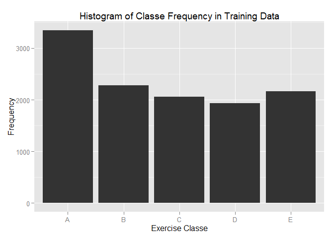
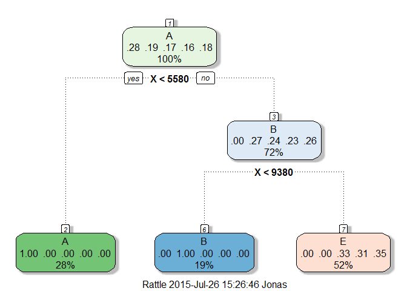
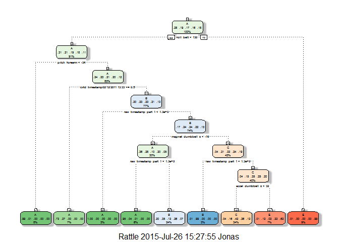
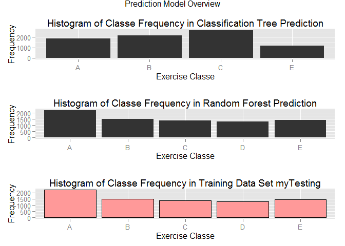

# Practical Machine Learning - Course Project
Jonas A.  
Saturday, July 25, 2015  

The goal of this project is to create a machine-learning algorithm that can correctly identify the quality of barbell bicep curls by using data from belt, forearm, arm, and dumbbell monitors. There are five classifications of this exercise, one method is the correct form of the exercise (Class A) while the other four are common mistakes: throwing the elbows to the front (Class B), lifting the dumbbell only halfway (Class C), lowering the dumbbell only halfway (Class D) and throwing the hips to the front (Class E). <http://groupware.les.inf.puc-rio.br/har#ixzz3PO5pnm1R>.

#Load and pre-process data

The two data files are downloaded from <https://d396qusza40orc.cloudfront.net/predmachlearn/pml-training.csv> (training set) and <https://d396qusza40orc.cloudfront.net/predmachlearn/pml-testing.csv> (testing set) and stored in the __R Working Directory__, which is the source location for the R code. During the loading process missing values are set to _NA_.

For reproducability the seed is set to _05111982_.


```r
library(caret, quietly=TRUE)
```

```
## Warning: package 'caret' was built under R version 3.1.3
```

```
## Warning: package 'lattice' was built under R version 3.1.3
```

```
## Warning: package 'ggplot2' was built under R version 3.1.3
```

```r
library(rattle, quietly=TRUE)
```

```
## Warning: package 'rattle' was built under R version 3.1.3
```

```
## Warning: package 'RGtk2' was built under R version 3.1.3
```

```
## Rattle: Ein kostenloses grafisches Interface für Data Mining mit R.
## Version 3.5.0 Copyright (c) 2006-2015 Togaware Pty Ltd.
## Geben Sie 'rattle()' ein, um Ihre Daten mischen.
```

```r
library(ggplot2, quietly=TRUE)
library(grid, quietly=TRUE)
library(gridExtra, quietly=TRUE)
```

```
## Warning: package 'gridExtra' was built under R version 3.1.3
```

```r
set.seed(05111982)

pml_train <- read.csv(file = 'pml-training.csv',
                      na.strings = c('NA','#DIV/0!',''))
pml_test <- read.csv(file = 'pml-testing.csv',
                     na.strings = c('NA','#DIV/0!',''))
```

It is important to compare the dataset which is done by comparing the dimensions.


```r
dim(pml_train)
```

```
## [1] 19622   160
```

```r
dim(pml_test)
```

```
## [1]  20 160
```

The summary of both test sets (not shown) reveal that several parameters / columns only have missing / NA values. These parameters / columns are removed in both data sets and a comparison for the dimensions performed.


```r
#summary(pml_train)
#summary(pml_test)

pml_train <- pml_train[,colSums(is.na(pml_train))==0]
pml_test <- pml_test[,colSums(is.na(pml_test))==0]

dim(pml_train)
```

```
## [1] 19622    60
```

```r
dim(pml_test)
```

```
## [1] 20 60
```

It might be the case that several values do not really change for the different classes. To detect this a near zero variation analysis is performed and the parameter "new_window" is removed in both data sets. This changes both datasets equally.


```r
nearZeroVar(pml_train, saveMetrics=TRUE)
```

```
##                      freqRatio percentUnique zeroVar   nzv
## X                     1.000000  100.00000000   FALSE FALSE
## user_name             1.100679    0.03057792   FALSE FALSE
## raw_timestamp_part_1  1.000000    4.26562022   FALSE FALSE
## raw_timestamp_part_2  1.000000   85.53154622   FALSE FALSE
## cvtd_timestamp        1.000668    0.10192641   FALSE FALSE
## new_window           47.330049    0.01019264   FALSE  TRUE
## num_window            1.000000    4.37264295   FALSE FALSE
## roll_belt             1.101904    6.77810621   FALSE FALSE
## pitch_belt            1.036082    9.37722964   FALSE FALSE
## yaw_belt              1.058480    9.97349913   FALSE FALSE
## total_accel_belt      1.063160    0.14779329   FALSE FALSE
## gyros_belt_x          1.058651    0.71348486   FALSE FALSE
## gyros_belt_y          1.144000    0.35164611   FALSE FALSE
## gyros_belt_z          1.066214    0.86127816   FALSE FALSE
## accel_belt_x          1.055412    0.83579655   FALSE FALSE
## accel_belt_y          1.113725    0.72877383   FALSE FALSE
## accel_belt_z          1.078767    1.52379982   FALSE FALSE
## magnet_belt_x         1.090141    1.66649679   FALSE FALSE
## magnet_belt_y         1.099688    1.51870350   FALSE FALSE
## magnet_belt_z         1.006369    2.32901845   FALSE FALSE
## roll_arm             52.338462   13.52563449   FALSE FALSE
## pitch_arm            87.256410   15.73234125   FALSE FALSE
## yaw_arm              33.029126   14.65701763   FALSE FALSE
## total_accel_arm       1.024526    0.33635715   FALSE FALSE
## gyros_arm_x           1.015504    3.27693405   FALSE FALSE
## gyros_arm_y           1.454369    1.91621649   FALSE FALSE
## gyros_arm_z           1.110687    1.26388747   FALSE FALSE
## accel_arm_x           1.017341    3.95984099   FALSE FALSE
## accel_arm_y           1.140187    2.73672409   FALSE FALSE
## accel_arm_z           1.128000    4.03628580   FALSE FALSE
## magnet_arm_x          1.000000    6.82397309   FALSE FALSE
## magnet_arm_y          1.056818    4.44399144   FALSE FALSE
## magnet_arm_z          1.036364    6.44684538   FALSE FALSE
## roll_dumbbell         1.022388   84.20650290   FALSE FALSE
## pitch_dumbbell        2.277372   81.74498012   FALSE FALSE
## yaw_dumbbell          1.132231   83.48282540   FALSE FALSE
## total_accel_dumbbell  1.072634    0.21914178   FALSE FALSE
## gyros_dumbbell_x      1.003268    1.22821323   FALSE FALSE
## gyros_dumbbell_y      1.264957    1.41677709   FALSE FALSE
## gyros_dumbbell_z      1.060100    1.04984201   FALSE FALSE
## accel_dumbbell_x      1.018018    2.16593619   FALSE FALSE
## accel_dumbbell_y      1.053061    2.37488533   FALSE FALSE
## accel_dumbbell_z      1.133333    2.08949139   FALSE FALSE
## magnet_dumbbell_x     1.098266    5.74864948   FALSE FALSE
## magnet_dumbbell_y     1.197740    4.30129447   FALSE FALSE
## magnet_dumbbell_z     1.020833    3.44511263   FALSE FALSE
## roll_forearm         11.589286   11.08959331   FALSE FALSE
## pitch_forearm        65.983051   14.85577413   FALSE FALSE
## yaw_forearm          15.322835   10.14677403   FALSE FALSE
## total_accel_forearm   1.128928    0.35674243   FALSE FALSE
## gyros_forearm_x       1.059273    1.51870350   FALSE FALSE
## gyros_forearm_y       1.036554    3.77637346   FALSE FALSE
## gyros_forearm_z       1.122917    1.56457038   FALSE FALSE
## accel_forearm_x       1.126437    4.04647844   FALSE FALSE
## accel_forearm_y       1.059406    5.11160942   FALSE FALSE
## accel_forearm_z       1.006250    2.95586586   FALSE FALSE
## magnet_forearm_x      1.012346    7.76679238   FALSE FALSE
## magnet_forearm_y      1.246914    9.54031189   FALSE FALSE
## magnet_forearm_z      1.000000    8.57710733   FALSE FALSE
## classe                1.469581    0.02548160   FALSE FALSE
```

```r
pml_train$new_window=NULL
pml_test$new_window=NULL

dim(pml_train)
```

```
## [1] 19622    59
```

```r
dim(pml_test)
```

```
## [1] 20 59
```

#Partioning the training set

The training data set is divided in a training and testing data set. The new training data set contains 60% of the former training set and is used to train the model, whereas the new testing data set contains 40% of the former training set and is used to test the model.


```r
inTrain <- createDataPartition(y=pml_train$classe, p=0.6, list=FALSE)
myTraining <- pml_train[inTrain, ]
myTesting <- pml_train[-inTrain, ]
dim(myTraining)
```

```
## [1] 11776    59
```

```r
dim(myTesting)
```

```
## [1] 7846   59
```

The following histogram shows the frequency of the different classes in the new training data set allowing an estimate for the outcome of the prediction model.


```r
ggplot(myTraining, aes(x = classe)) + ggtitle("Histogram of Classe Frequency in Training Data") + xlab("Exercise Classe") + ylab("Frequency") + geom_histogram()
```

 

#Prediction with Decision Tree

As the outcome is factorial the first model is done by the classification tree algorithm.

Most probably the first benchmark is the model accuracy, which is with approx. 66% kind of disappointing. If the final model is checked more carefully it gets obvious that the X variable (which is the id) might not be the best parameter / variable for the prediction.

Additionally, the confusion matrix shows that no class C or D are detected in the new testing data set. Having the distribution of the new training set in mind, this prediction model seems to be not very useful. Even more suspicious is the outcome of the prediction for the final test set, resulting in 100% class A.


```r
modFitTree <- train(classe ~ ., method="rpart", data=myTraining)
```

```
## Loading required package: rpart
```

```r
print(modFitTree$finalModel)
```

```
## n= 11776 
## 
## node), split, n, loss, yval, (yprob)
##       * denotes terminal node
## 
## 1) root 11776 8428 A (0.28 0.19 0.17 0.16 0.18)  
##   2) X< 5580 3348    0 A (1 0 0 0 0) *
##   3) X>=5580 8428 6149 B (0 0.27 0.24 0.23 0.26)  
##     6) X< 9379.5 2279    0 B (0 1 0 0 0) *
##     7) X>=9379.5 6149 3984 E (0 0 0.33 0.31 0.35) *
```

```r
fancyRpartPlot(modFitTree$finalModel)
```

 

```r
classepredict <- predict(modFitTree,myTesting)
confusionMatrix(myTesting$classe,classepredict)
```

```
## Confusion Matrix and Statistics
## 
##           Reference
## Prediction    A    B    C    D    E
##          A 2231    1    0    0    0
##          B    0 1518    0    0    0
##          C    0    2    0    0 1366
##          D    0    0    0    0 1286
##          E    0    0    0    0 1442
## 
## Overall Statistics
##                                          
##                Accuracy : 0.6616         
##                  95% CI : (0.651, 0.6721)
##     No Information Rate : 0.5218         
##     P-Value [Acc > NIR] : < 2.2e-16      
##                                          
##                   Kappa : 0.5693         
##  Mcnemar's Test P-Value : NA             
## 
## Statistics by Class:
## 
##                      Class: A Class: B Class: C Class: D Class: E
## Sensitivity            1.0000   0.9980       NA       NA   0.3522
## Specificity            0.9998   1.0000   0.8256   0.8361   1.0000
## Pos Pred Value         0.9996   1.0000       NA       NA   1.0000
## Neg Pred Value         1.0000   0.9995       NA       NA   0.5859
## Prevalence             0.2843   0.1939   0.0000   0.0000   0.5218
## Detection Rate         0.2843   0.1935   0.0000   0.0000   0.1838
## Detection Prevalence   0.2845   0.1935   0.1744   0.1639   0.1838
## Balanced Accuracy      0.9999   0.9990       NA       NA   0.6761
```

```r
predict(modFitTree,newdata=pml_test)
```

```
##  [1] A A A A A A A A A A A A A A A A A A A A
## Levels: A B C D E
```

# Additional pre-processing

For a second prediction with decision tree the parameter / column X (id) is removed in both training and testing data set. Additionally the training data set is divided into a new training and testing data set as before.


```r
pml_train$X=NULL
pml_test$X=NULL

dim(pml_train)
```

```
## [1] 19622    58
```

```r
dim(pml_test)
```

```
## [1] 20 58
```

```r
inTrain <- createDataPartition(y=pml_train$classe, p=0.6, list=FALSE)
myTraining <- pml_train[inTrain, ]
myTesting <- pml_train[-inTrain, ]
dim(myTraining)
```

```
## [1] 11776    58
```

```r
dim(myTesting)
```

```
## [1] 7846   58
```

#Prediction with Decision Tree

The second decision tree model leads to a much more complex dicision tree. Unfortunately, the confusion matrix shows an even worse accuracy and additionally, no class C is detected. Again, this might not be the best prediction model. 


```r
modFitTree <- train(classe ~ ., method="rpart", data=myTraining)
print(modFitTree$finalModel)
```

```
## n= 11776 
## 
## node), split, n, loss, yval, (yprob)
##       * denotes terminal node
## 
##   1) root 11776 8428 A (0.28 0.19 0.17 0.16 0.18)  
##     2) roll_belt< 130.5 10757 7417 A (0.31 0.21 0.19 0.18 0.11)  
##       4) pitch_forearm< -33.95 950    5 A (0.99 0.0053 0 0 0) *
##       5) pitch_forearm>=-33.95 9807 7412 A (0.24 0.23 0.21 0.2 0.12)  
##        10) cvtd_timestamp02/12/2011 13:33>=0.5 775  210 A (0.73 0.27 0 0 0) *
##        11) cvtd_timestamp02/12/2011 13:33< 0.5 9032 6968 B (0.2 0.23 0.23 0.21 0.13)  
##          22) raw_timestamp_part_1< 1.32249e+09 359    0 A (1 0 0 0 0) *
##          23) raw_timestamp_part_1>=1.32249e+09 8673 6609 B (0.17 0.24 0.24 0.22 0.13)  
##            46) magnet_dumbbell_z< -16.5 3566 2283 A (0.36 0.28 0.1 0.2 0.052)  
##              92) raw_timestamp_part_1< 1.322838e+09 749   36 A (0.95 0.039 0.008 0 0.0013) *
##              93) raw_timestamp_part_1>=1.322838e+09 2817 1843 B (0.2 0.35 0.13 0.26 0.066) *
##            47) magnet_dumbbell_z>=-16.5 5107 3419 C (0.037 0.21 0.33 0.24 0.19)  
##              94) raw_timestamp_part_1< 1.32249e+09 351    5 B (0.011 0.99 0.0028 0 0) *
##              95) raw_timestamp_part_1>=1.32249e+09 4756 3069 C (0.039 0.15 0.35 0.25 0.2)  
##               190) accel_dumbbell_z< 32.5 3951 2279 C (0.044 0.16 0.42 0.26 0.12) *
##               191) accel_dumbbell_z>=32.5 805  303 E (0.015 0.12 0.019 0.22 0.62) *
##     3) roll_belt>=130.5 1019    8 E (0.0079 0 0 0 0.99) *
```

```r
fancyRpartPlot(modFitTree$finalModel)
```

 

```r
classepredict <- predict(modFitTree,myTesting)
confusionMatrix(myTesting$classe,classepredict)
```

```
## Confusion Matrix and Statistics
## 
##           Reference
## Prediction    A    B    C    D    E
##          A 1700  391  124    0   17
##          B  150  885  424    0   59
##          C    2  266 1092    0    8
##          D    0  501  670    0  115
##          E    0  130  345    0  967
## 
## Overall Statistics
##                                           
##                Accuracy : 0.5919          
##                  95% CI : (0.5809, 0.6028)
##     No Information Rate : 0.3384          
##     P-Value [Acc > NIR] : < 2.2e-16       
##                                           
##                   Kappa : 0.4853          
##  Mcnemar's Test P-Value : NA              
## 
## Statistics by Class:
## 
##                      Class: A Class: B Class: C Class: D Class: E
## Sensitivity            0.9179   0.4073   0.4113       NA   0.8293
## Specificity            0.9112   0.8884   0.9468   0.8361   0.9289
## Pos Pred Value         0.7616   0.5830   0.7982       NA   0.6706
## Neg Pred Value         0.9729   0.7965   0.7587       NA   0.9689
## Prevalence             0.2360   0.2770   0.3384   0.0000   0.1486
## Detection Rate         0.2167   0.1128   0.1392   0.0000   0.1232
## Detection Prevalence   0.2845   0.1935   0.1744   0.1639   0.1838
## Balanced Accuracy      0.9146   0.6478   0.6791       NA   0.8791
```

#Prediction with Random Forest

Another approach is using random forest with cross validation (4x). The prediction model leads to a confusion matrix with a accuracy of 99.99%.


```r
mod_rf <- train(classe ~ .,
                data = myTraining, 
                method = 'rf', 
                trControl = trainControl(method = "cv", 
                                         number = 4, 
                                         allowParallel = TRUE, 
                                         verboseIter = TRUE))
```

```
## Loading required package: randomForest
```

```
## Warning: package 'randomForest' was built under R version 3.1.3
```

```
## randomForest 4.6-10
## Type rfNews() to see new features/changes/bug fixes.
```

```
## + Fold1: mtry= 2 
## - Fold1: mtry= 2 
## + Fold1: mtry=40 
## - Fold1: mtry=40 
## + Fold1: mtry=79 
## - Fold1: mtry=79 
## + Fold2: mtry= 2 
## - Fold2: mtry= 2 
## + Fold2: mtry=40 
## - Fold2: mtry=40 
## + Fold2: mtry=79 
## - Fold2: mtry=79 
## + Fold3: mtry= 2 
## - Fold3: mtry= 2 
## + Fold3: mtry=40 
## - Fold3: mtry=40 
## + Fold3: mtry=79 
## - Fold3: mtry=79 
## + Fold4: mtry= 2 
## - Fold4: mtry= 2 
## + Fold4: mtry=40 
## - Fold4: mtry=40 
## + Fold4: mtry=79 
## - Fold4: mtry=79 
## Aggregating results
## Selecting tuning parameters
## Fitting mtry = 40 on full training set
```

```r
pred_rf <- predict(mod_rf,myTesting)
confusionMatrix(pred_rf,myTesting$classe)
```

```
## Confusion Matrix and Statistics
## 
##           Reference
## Prediction    A    B    C    D    E
##          A 2232    0    0    0    0
##          B    0 1518    0    0    0
##          C    0    0 1368    0    0
##          D    0    0    0 1285    0
##          E    0    0    0    1 1442
## 
## Overall Statistics
##                                      
##                Accuracy : 0.9999     
##                  95% CI : (0.9993, 1)
##     No Information Rate : 0.2845     
##     P-Value [Acc > NIR] : < 2.2e-16  
##                                      
##                   Kappa : 0.9998     
##  Mcnemar's Test P-Value : NA         
## 
## Statistics by Class:
## 
##                      Class: A Class: B Class: C Class: D Class: E
## Sensitivity            1.0000   1.0000   1.0000   0.9992   1.0000
## Specificity            1.0000   1.0000   1.0000   1.0000   0.9998
## Pos Pred Value         1.0000   1.0000   1.0000   1.0000   0.9993
## Neg Pred Value         1.0000   1.0000   1.0000   0.9998   1.0000
## Prevalence             0.2845   0.1935   0.1744   0.1639   0.1838
## Detection Rate         0.2845   0.1935   0.1744   0.1638   0.1838
## Detection Prevalence   0.2845   0.1935   0.1744   0.1638   0.1839
## Balanced Accuracy      1.0000   1.0000   1.0000   0.9996   0.9999
```

To get a better idea how well distributed the predictions are a data frame is created including the prediction from the classification tree (2nd) approach and the random forest approach compared to the results from the subpart of the training data set (my testing data set).

The summary and the figure show clearly that the distribution of the random forest looks very promising, which makes sense as the accuracy of this model is nearly 100% and the out-of sample error is with 1-0.9999 = 0.0001 very low. This model will be used for the final test set prediction.


```r
summary_myTest <- data.frame(classepredict, pred_rf, myTesting$classe)
colnames(summary_myTest) <- c("Pred_CT", "Pred_RF", "Result")

summary(summary_myTest)
```

```
##  Pred_CT  Pred_RF  Result  
##  A:1852   A:2232   A:2232  
##  B:2173   B:1518   B:1518  
##  C:2655   C:1368   C:1368  
##  D:   0   D:1285   D:1286  
##  E:1166   E:1443   E:1442
```

```r
pPred_CT <- ggplot(summary_myTest, aes(x = Pred_CT)) + ggtitle("Histogram of Classe Frequency in Classification Tree Prediction") + xlab("Exercise Classe") + ylab("Frequency") + geom_histogram()

pPred_RF <- ggplot(summary_myTest, aes(x = Pred_RF)) + ggtitle("Histogram of Classe Frequency in Random Forest Prediction") + xlab("Exercise Classe") + ylab("Frequency") + geom_histogram()

pResult <- ggplot(summary_myTest, aes(x = Result)) + ggtitle("Histogram of Classe Frequency in Training Data Set myTesting") + xlab("Exercise Classe") + ylab("Frequency") + geom_histogram(fill="#FF9999", colour="black")

grid.arrange(pPred_CT, pPred_RF, pResult, ncol = 1, main = "Prediction Model Overview")
```

 

#Random Forest prediction (test set)

The final prediction of the test set is performed and exported into different txt files for the upload.


```r
pred_rf_test <- predict(mod_rf,pml_test)

pred_rf_test
```

```
##  [1] B A B A A E D B A A B C B A E E A B B B
## Levels: A B C D E
```

```r
pml_write_files = function(x){
  n = length(x)
  for(i in 1:n){
    filename = paste0("problem_id_",i,".txt")
    write.table(x[i],file=filename,quote=FALSE,row.names=FALSE,col.names=FALSE)
  }
}

pml_write_files(pred_rf_test)
```
